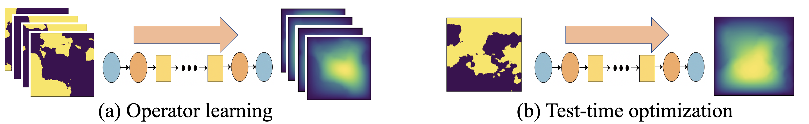

# Physics-Informed Neural Operator for Learning Partial Differential Equations

# 📢 DEPRECATION NOTICE 📢  
----------------------------

🚨 **This repository is no longer maintained.** 🚨 The code in this repository is **deprecated** and may not work with newer dependencies or frameworks.  
For the most up-to-date implementation and continued development, please visit:  

## ➡️ **[NeuralOperator](https://github.com/neuraloperator/neuraloperator)** ⬅️

🔴 We strongly recommend using the latest version to ensure compatibility, performance, and support.🔴  

----------------------------


[comment]: <> (![Results on Navier Stokes equation]&#40;docs/solver-pino.png&#41;)


# Paper Info


This repo contains code for experiments from the paper [Physics-Informed Neural Operator for Learning Partial Differential Equations](https://arxiv.org/abs/2111.03794) (2021) by Zongyi Li, Hongkai Zheng, Nikola Kovachki, David Jin, Haoxuan Chen, Burigede Liu, Kamyar Azizzadenesheli, and Anima Anandkumar.

Abstract: 
> Machine learning methods have recently shown promise in solving partial differential equations (PDEs). They can be classified into two broad categories: solution function approximation and operator learning. The Physics-Informed Neural Network (PINN) is an example of the former while the Fourier neural operator (FNO) is an example of the latter. Both these approaches have shortcomings. The optimization in PINN is challenging and prone to failure, especially on multi-scale dynamic systems. FNO does not suffer from this optimization issue since it carries out supervised learning on a given dataset, but obtaining such data may be too expensive or infeasible. In this work, we propose the physics-informed neural operator (PINO), where we combine the operating-learning and function-optimization frameworks, and this improves convergence rates and accuracy over both PINN and FNO models. In the operator-learning phase, PINO learns the solution operator over multiple instances of the parametric PDE family. In the test-time optimization phase, PINO optimizes the pre-trained operator ansatz for the querying instance of the PDE. Experiments show PINO outperforms previous ML methods on many popular PDE families while retaining the extraordinary speed-up of FNO compared to solvers. In particular, PINO accurately solves long temporal transient flows and  Kolmogorov flows, while PINN and other methods fail to converge.
## Requirements
- Pytorch 1.8.0 or later
- wandb
- tqdm
- scipy
- h5py
- numpy
- DeepXDE:latest
- Latest code from tensordiffeq github master branch (Not tensordiffeq 0.19)
- tensorflow 2.4.0

## Data description
### Burgers equation
[burgers_pino.mat](https://hkzdata.s3.us-west-2.amazonaws.com/PINO/data/burgers_pino.mat)

### Darcy flow 
- spatial domain: $x\in (0,1)^2$
- Data file: 
  - [piececonst_r421_N1024_smooth1.mat](https://hkzdata.s3.us-west-2.amazonaws.com/PINO/data/piececonst_r421_N1024_smooth1.mat)
  - [piececonst_r421_N1024_smooth2.mat](https://hkzdata.s3.us-west-2.amazonaws.com/PINO/data/piececonst_r421_N1024_smooth2.mat)
- Raw data shape: 1024x421x421


### Long roll out of Navier Stokes equation
- spatial domain: $x\in (0, 1)^2$
- temporal domain: $t\in \[0, 49\]$
- forcing: $0.1(\sin(2\pi(x_1+x_2)) + \cos(2\pi(x_1+x_2)))$
- viscosity = 0.001

Data file: `nv_V1e-3_N5000_T50.mat`, with shape 50 x 64 x 64 x 5000 

- train set: -1-4799
- test set: 4799-4999
### Navier Stokes with Reynolds number 500
- spatial domain: $x\in (0, 2\pi)^2$
- temporal domain: $t \in \[0, 0.5\]$
- forcing: $-4\cos(4x_2)$
- Reynolds number: 500

Train set: data of shape (N, T, X, Y) where N is the number of instances, T is temporal resolution, X, Y are spatial resolutions. 
1. [NS_fft_Re500_T4000.npy](https://hkzdata.s3.us-west-2.amazonaws.com/PINO/data/NS_fft_Re500_T4000.npy) : 4000x64x64x65
2. [NS_fine_Re500_T128_part0.npy](https://hkzdata.s3.us-west-2.amazonaws.com/PINO/data/NS_fine_Re500_T128_part0.npy): 100x129x128x128
3. [NS_fine_Re500_T128_part1.npy](https://hkzdata.s3.us-west-2.amazonaws.com/PINO/data/NS_fine_Re500_T128_part1.npy): 100x129x128x128

Test set: data of shape (N, T, X, Y) where N is the number of instances, T is temporal resolution, X, Y are spatial resolutions. 
1. [NS_Re500_s256_T100_test.npy](https://hkzdata.s3.us-west-2.amazonaws.com/PINO/data/NS_Re500_s256_T100_test.npy): 100x129x256x256
2. [NS_fine_Re500_T128_part2.npy](https://hkzdata.s3.us-west-2.amazonaws.com/PINO/data/NS_fine_Re500_T128_part2.npy): 100x129x128x128

Configuration file format: see `.yaml` files under folder `configs` for detail. 

## Code for Burgers equation
### Train PINO
To run PINO for Burgers equation, use, e.g.,
```bash 
python3 train_burgers.py --config_path configs/pretrain/burgers-pretrain.yaml --mode train
```

To test PINO for burgers equation, use, e.g., 
```bash
python3 train_burgers.py --config_path configs/test/burgers.yaml --mode test
```

## Code for Darcy Flow

### Operator learning
To run PINO for Darcy Flow, use, e.g., 
```bash
python3 train_operator.py --config_path configs/pretrain/Darcy-pretrain.yaml
```
To evaluate operator for Darcy Flow, use, e.g., 
```bash
python3 eval_operator.py --config_path configs/test/darcy.yaml
```

### Test-time optimization
To do test-time optimization for Darcy Flow, use, e.g., 
```bash
python3 run_pino2d.py --config_path configs/finetune/Darcy-finetune.yaml --start [starting index] --stop [stopping index]
```

### Baseline
To run DeepONet, use, e.g., 
```bash
python3 deeponet.py --config_path configs/pretrain/Darcy-pretrain-deeponet.yaml --mode train 
```
To test DeepONet, use, e.g., 
```bash
python3 deeponet.py --config_path configs/test/darcy.yaml --mode test
```


## Code for Navier Stokes equation
### Run exp on new dataset
Train PINO with 800 low-res data and 2200 PDE. 
```bash
python3 train_pino.py --config configs/operator/Re500-1_8-800-PINO-s.yaml
```
Train FNO with 800 low-res data and 2200 PDE.
```bash
python3 train_pino.py --config configs/operator/Re500-1_8-800-FNO-s.yaml
```
Run instance-wise finetuning
```bash
python3 instance_opt.py --config configs/instance/Re500-1_8-PINO-s.yaml
```

### Train PINO for short time period
To run operator learning, use, e.g., 
```bash
python3 train_operator.py --config_path configs/pretrain/Re500-pretrain-05s-4C0.yaml
```
To evaluate trained operator, use
```bash
python3 eval_operator.py --config_path configs/test/Re500-05s.yaml
```
To run test-time optimization, use
```bash
python3 train_PINO3d.py --config_path configs/***.yaml 
```

To train Navier Stokes equations sequentially without running `train_PINO3d.py` multiple times, use

```bash
python3 run_pino3d.py --config_path configs/[configuration file name].yaml --start [index of the first data] --stop [which data to stop]
```


### Baseline for short time period
To train DeepONet, use 
```bash
python3 deeponet.py --config_path configs/[configuration file].yaml --mode train
```

To test DeepONet, use 
```bash
python3 deeponet.py --config_path configs/[configuration file].yaml --mode test
```

To train and test PINNs, use, e.g.,  
```bash
python3 pinns.py --config_path configs/baseline/Re500-pinns-05s.yaml --start [starting index] --stop [stopping index]
```

To train and test LAAF-PINN, use, e.g., 
```bash
python3 pinns.py configs/baseline/Re500-pinns-05s-LAAF.yaml --start [starting index] --stop [stopping index]
```

To train and test SA-PINNs, first copy the latest code of tensordiffeq under the working directory.
Then run: 
```bash 
DDEBACKEND=pytorch python3 pinns.py configs/baseline/Re500-pinns-05s-SA.yaml --start [starting index] --stop [stopping index]
```

### Baseline for long roll out
To train and test PINNs, use
```bash
python3 pinns.py --config_path configs/baseline/NS-50s.yaml --start [starting index] --stop [stopping index]
```

To train and test LAAF-PINN, use, e.g., 
```bash
python3 pinns.py --config_path configs/baseline/NS-50s-LAAF.yaml --start [starting index] --stop [stopping index]
```

### Pseudospectral solver for Navier Stokes equation
To run solver, use 
```bash
python3 run_solver.py --config_path configs/Re500-0.5s.yaml
```
